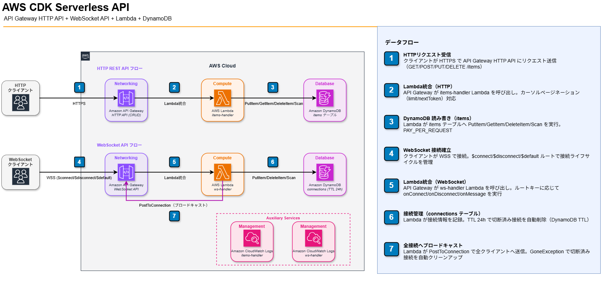

# aws-cdk-serverless-api

[](https://github.com/satoshif1977/aws-cdk-serverless-api/actions/workflows/ci.yml)
[](https://github.com/satoshif1977/aws-cdk-serverless-api/actions/workflows/ts-test.yml)
[](https://github.com/satoshif1977/aws-cdk-serverless-api/actions/workflows/go-test.yml)
[](https://github.com/satoshif1977/aws-cdk-serverless-api/actions/workflows/python-test.yml)
[](https://codecov.io/gh/satoshif1977/aws-cdk-serverless-api)


AWS CDK（TypeScript）で実装したサーバーレス API。
API Gateway HTTP API（REST CRUD）+ WebSocket API（リアルタイムブロードキャスト）+ Lambda + DynamoDB をコードだけで構築します。

## アーキテクチャ



> draw.io ソースファイルは `docs/architecture.drawio` にあります。[app.diagrams.net](https://app.diagrams.net) で開くか、draw.io デスクトップアプリで「Open from → This device」から開いてください。

```
クライアント（HTTP）
    │ HTTPS
    ▼
Amazon API Gateway HTTP API
    │ GET /items?limit=N&nextToken=xxx  → 全件取得（カーソルページネーション）
    │ GET /items/{id}                   → 1件取得
    │ POST /items                       → 新規作成
    │ PUT /items/{id}                   → 更新
    │ DELETE /items/{id}                → 削除
    ▼ Lambda 統合
AWS Lambda - items-handler (Node.js 22.x)
    │ GetItem/PutItem/DeleteItem/Scan
    ▼
Amazon DynamoDB - items テーブル (PAY_PER_REQUEST)

クライアント（WebSocket）
    │ WSS
    ▼
Amazon API Gateway WebSocket API
    │ $connect    → 接続登録
    │ $disconnect → 接続削除
    │ $default    → 全接続へブロードキャスト
    ▼ Lambda 統合
AWS Lambda - ws-handler (Node.js 22.x)
    │ PutItem/DeleteItem/Scan + PostToConnection
    ▼
Amazon DynamoDB - connections テーブル (TTL: 24時間)
```

## 技術スタック

| 技術 | 内容 |
|---|---|
| AWS CDK v2 | IaC（TypeScript） |
| API Gateway HTTP API | REST エンドポイント（CORS・カーソルページネーション） |
| API Gateway WebSocket API | リアルタイムブロードキャスト（$connect/$disconnect/$default） |
| Lambda NodejsFunction | TypeScript → esbuild で自動バンドル |
| DynamoDB | PAY_PER_REQUEST（TTL による接続自動クリーンアップ） |
| AWS SDK v3 | `@aws-sdk/client-dynamodb` / `@aws-sdk/client-apigatewaymanagementapi` |
| Jest + CDK Assertions | ユニットテスト（33件・TypeScript） |
| Go Lambda（並置） | items_handler Go 実装（DynamoDB CRUD・27件テスト） |
| Python 検証スクリプト（並置） | boto3 + pytest でデプロイ後のリソースを検証（37件テスト） |
| GitHub Actions | push / PR 時に型チェック & テスト自動実行（CI / Go Test / Python Test） |

## ディレクトリ構成

```
aws-cdk-serverless-api/
├── bin/
│   └── aws-cdk-serverless-api.ts        # CDK App エントリーポイント
├── lib/
│   └── aws-cdk-serverless-api-stack.ts  # CDK スタック定義
├── src/
│   └── handlers/
│       ├── items.ts                     # Lambda ハンドラー（HTTP CRUD）
│       ├── ws.ts                        # Lambda ハンドラー（WebSocket）
│       ├── helpers.ts                   # レスポンス生成・ボディパース
│       ├── validators.ts                # HTTP API の入力バリデーション
│       ├── ws-validators.ts             # WebSocket の入力バリデーション
│       ├── retry.ts                     # 指数バックオフ + フルジッターのリトライ
│       ├── logger.ts                    # 構造化ログ + 機密情報マスキング
│       └── types.ts                     # 共有の型定義
├── lambda_go/
│   └── items_handler/
│       ├── main.go                      # Go 版 Lambda ハンドラー（CRUD・TypeScript 版との並置）
│       ├── retry.go                     # Go 版リトライ（TypeScript 版と同設計）
│       ├── *_test.go                    # Go ユニットテスト（DynamoDBAPI モック）
│       └── go.mod
├── test/
│   ├── aws-cdk-serverless-api*.test.ts  # CDK Assertions テスト（インフラ）
│   ├── items.handler*.test.ts           # items ハンドラー ユニットテスト
│   ├── ws.handler*.test.ts              # ws ハンドラー ユニットテスト
│   ├── validators.test.ts               # バリデーション ユニットテスト
│   ├── ws-validators.test.ts            # WebSocket バリデーション ユニットテスト
│   ├── retry.test.ts                    # リトライ ユニットテスト
│   └── logger.test.ts                   # 構造化ログ ユニットテスト
├── scripts/
│   ├── verify_stack.py                  # Python 版スタック検証（boto3・DI パターン）
│   ├── test_verify_stack.py             # pytest テスト（37件・MagicMock）
│   └── requirements-dev.txt             # pytest + boto3
└── .github/workflows/
    ├── ci.yml                           # CDK Assertions テスト CI
    ├── ts-test.yml                      # TypeScript 型チェック + Jest CI
    ├── cdk-synth.yml                    # CDK 構文検証 CI
    ├── cdk-diff.yml                     # CDK Diff コメント CI
    ├── go-test.yml                      # Go ユニットテスト CI
    └── python-test.yml                  # Python ユニットテスト CI
```

## デプロイ手順

### 前提条件

- Node.js 22+
- AWS CLI 設定済み（`ap-northeast-1`）
- AWS CDK v2 インストール済み（`npm install -g aws-cdk`）

### 1. 依存パッケージインストール

```bash
npm install
```

### 2. CDK Bootstrap（初回のみ）

```bash
cdk bootstrap aws://YOUR_ACCOUNT_ID/ap-northeast-1
```

### 3. デプロイ

```bash
cdk deploy
```

デプロイ完了後、`ApiEndpoint`（HTTP）と `WsEndpoint`（WebSocket）の URL が出力されます。

### 4. 動作確認（HTTP API）

```bash
# アイテム作成
curl -X POST https://<API_ENDPOINT>/items \
  -H "Content-Type: application/json" \
  -d '{"name": "テストアイテム", "price": 1000}'

# 全件取得（ページネーション）
curl "https://<API_ENDPOINT>/items?limit=5"

# 次ページ取得
curl "https://<API_ENDPOINT>/items?limit=5&nextToken=<nextToken>"

# 1件取得
curl https://<API_ENDPOINT>/items/<ID>

# 更新
curl -X PUT https://<API_ENDPOINT>/items/<ID> \
  -H "Content-Type: application/json" \
  -d '{"name": "更新後アイテム", "price": 2000}'

# 削除
curl -X DELETE https://<API_ENDPOINT>/items/<ID>
```

### 5. 動作確認（WebSocket API）

```bash
# wscat インストール（初回のみ）
npm install -g wscat

# 接続（ターミナル1）
wscat -c wss://<WS_ENDPOINT>

# 接続（ターミナル2 - 別ウィンドウで）
wscat -c wss://<WS_ENDPOINT>

# ターミナル1 から送信すると、接続中の全クライアントにブロードキャストされます
> {"action":"hello","data":"こんにちは！"}
```

> `WS_ENDPOINT` は `cdk deploy` 出力の `WsEndpoint` から `wss://` プレフィックスを確認してください。
> 切断済みの接続は DynamoDB TTL（24時間）で自動削除されます。

### 6. リソース削除

```bash
cdk destroy
```

## ローカルテスト

```bash
npm test
```

CDK Assertions・ハンドラー・ユーティリティのユニットテスト合計 456件が
ローカルで実行されます。実際の AWS 環境への接続は不要です。

## 構造化ログ

Lambda のログは 1 行の JSON として出力されます（`src/handlers/logger.ts`）。
CloudWatch Logs Insights でフィールド単位の検索・集計ができます。

### ログレベル

環境変数 `LOG_LEVEL` で制御します（未設定なら `info`）。

| 値 | 出力される内容 |
|---|---|
| `debug` | すべて |
| `info`（既定） | info / warn / error |
| `warn` | warn / error |
| `error` | error のみ |
| `silent` | 何も出力しない |

`WARNING` / `FATAL` / `off` のような表記も解釈します。**未知の値を指定しても
例外にはならず `info` にフォールバック**するため、設定ミスでログが消えることはありません。

### 出力例

```json
{"requestId":"abc-123","itemId":"i-001","password":"[REDACTED]","timestamp":"2026-09-07T00:00:00.000Z","level":"info","message":"アイテムを作成しました"}
```

### 機密情報のマスキング

`password` / `token` / `secret` / `apiKey` / `authorization` などのキーは
自動で `[REDACTED]` に置き換えられます。判定は**キー名の部分一致**で行うため、
`accessKeyId` や `x-api-key` のような派生名も拾えます
（記号を除いた小文字比較なので `access-key` / `access_key` / `AccessKey` は同一視）。

ログ出力で本処理を落とさないよう、次の保護も入っています。

- 循環参照 → `[Circular]`
- 深すぎるネスト・長すぎる配列や文字列 → `[Truncated]`
- `JSON.stringify` が `{}` に潰してしまう Error → `name` / `message` / `stack` に展開
- シリアライズ自体が失敗した場合 → 最低限の情報を持つフォールバック行を出力

### Logs Insights のサンプルクエリ

エラーを新しい順に確認する:

```
fields @timestamp, message, error.name, error.message
| filter level = "error"
| sort @timestamp desc
| limit 50
```

特定リクエストの流れを追う:

```
fields @timestamp, level, message
| filter requestId = "abc-123"
| sort @timestamp asc
```

リトライの発生状況を操作ごとに集計する（`retry.ts` と結線した場合）:

```
fields @timestamp, operation, attempt, delayMs
| filter level = "warn" and ispresent(operation)
| stats count(*) as リトライ回数 by operation
| sort リトライ回数 desc
```

出力キー（`timestamp` / `level` / `message`）は他リポジトリの Python 版・Go 版と
揃えているため、**同じクエリを言語をまたいで使えます**。

## 技術的なポイント・工夫

- **CDK NodejsFunction**: TypeScript のハンドラーコードを esbuild で自動バンドル。`tsc` でのコンパイル不要
- **HTTP API（v2）vs REST API（v1）**: HTTP API はコストが約70%低く、シンプルな CRUD には最適
- **カーソルページネーション**: `LastEvaluatedKey` を base64url エンコードして `nextToken` として返す。DynamoDB ネイティブのページング方式
- **WebSocket API**: $connect/$disconnect/$default ルートで接続管理・全接続へのブロードキャストを実装
- **GoneException 処理**: 送信失敗（クライアント切断済み）を `GoneException` で検知し DynamoDB から自動削除
- **DynamoDB TTL**: 接続レコードに 24時間後の Unix タイムスタンプを `ttl` フィールドで付与。切断後のゴミレコードを自動削除
- **PAY_PER_REQUEST**: DynamoDB のプロビジョニング不要モード。開発・低トラフィック環境でコスト最小
- **AWS SDK v3**: v2 より軽量・Tree Shaking 対応。`marshall` / `unmarshall` で型安全な DynamoDB 操作
- **CDK Assertions**: `Template.fromStack()` でインフラをユニットテスト。CloudFormation テンプレートの構造を検証
- **CORS 設定**: `corsPreflight` を HTTP API レベルで一元設定
- **構造化ログ + 機密情報マスキング**: ログを 1 行 JSON で出力し、`password` / `token` 等をキー名の部分一致で自動マスク。`now` / `sink` を注入可能にしてテストを決定的に保つ
- **指数バックオフ + フルジッター**: DynamoDB のスロットリングに対して AWS 公式推奨方式でリトライ。`retryLogger()` でリトライをログと結線できる

## AWS Well-Architected 観点

| 柱 | 対応内容 |
|---|---|
| セキュリティ | IAM 最小権限（`grantReadWriteData` / `grantManageConnections` で必要な権限のみ付与） |
| コスト最適化 | PAY_PER_REQUEST + HTTP API で使った分だけ課金・TTL で不要レコードを自動削除 |
| 運用性 | CloudWatch Logs 自動設定・1週間保持（HTTP / WebSocket 両 Lambda）・構造化ログで Logs Insights から検索/集計可能 |
| 信頼性 | DynamoDB はマネージドサービスで自動フェイルオーバー・GoneException で接続状態を自動整合 |

## Security

See [SECURITY.md](SECURITY.md) for vulnerability reporting and security policies.

## License

This project is licensed under the MIT License - see the [LICENSE](LICENSE) file for details.
